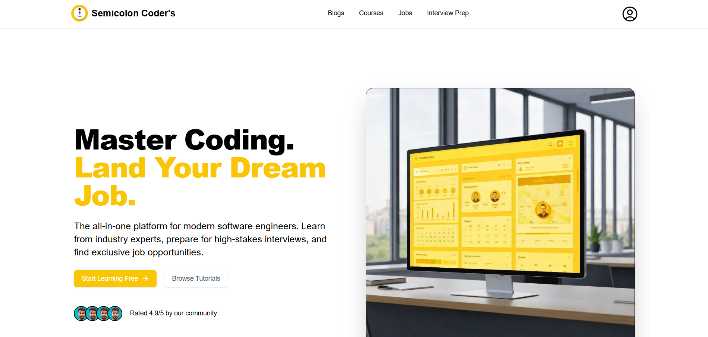
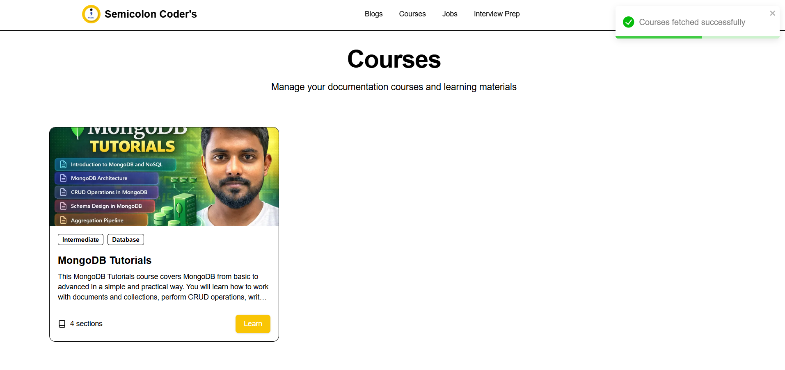
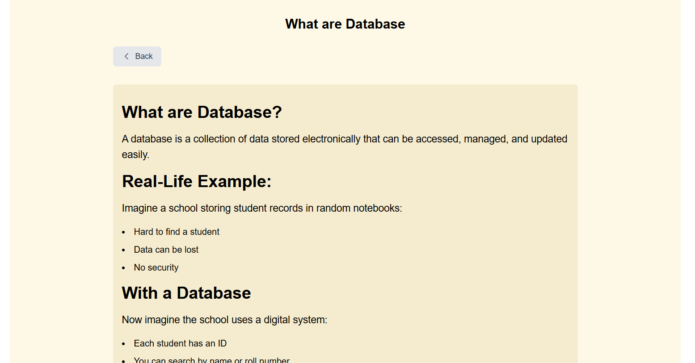

# Semicolon Coders

Semicolon Coders is a full-stack web application built with the Next.js, offering a platform for learning and career development in the tech industry. It includes features like courses, blogs, interview preparation materials, and job listings.

## ✨ Features

-   **Authentication:** Secure user sign-up and login functionality.
-   **Courses:** Create, manage, and enroll in courses with sections and subsections.
-   **Blogs:** A complete blog section where users can read and manage posts.
-   **Interview Prep:** A dedicated section for interview questions and preparation.
-   **Dashboard:** An admin dashboard to manage all platform content including courses, blogs, and interview questions.
-   **User Profiles:** Users can view and manage their profiles.

## 🛠️ Tech Stack

-   **Framework:** [Next.js](https://nextjs.org/)
-   **Language:** [TypeScript](https://www.typescriptlang.org/)
-   **Database:** [Prisma ORM](https://www.prisma.io/) with PostgreSQL (or other specified database)
-   **Styling:** [Tailwind CSS](https://tailwindcss.com/)
-   **Authentication:** JWT-based authentication
-   **File Uploads:** [Cloudinary](https://cloudinary.com/)

## 🚀 Getting Started

To get a local copy up and running, follow these simple steps.

### Prerequisites

-   Node.js (v18.x or later)
-   pnpm (or npm/yarn)
-   A configured database instance.

### Installation

1.  Clone the repo
    ```sh
    git clone https://github.com/your_username/semicolon_coders.git
    ```
2.  Install PNPM packages
    ```sh
    pnpm install
    ```
3.  Set up your environment variables by creating a `.env.local` file in the root directory. You will need to add database URLs, Cloudinary credentials, and other secrets.
    ```env
    DATABASE_URL="your_database_url"
    NEXTAUTH_SECRET="your_nextauth_secret"
    # Add other environment variables
    ```
4.  Run the development server
    ```sh
    pnpm run dev
    ```
    
## 📸 Screenshots







## 📂 Project Structure

The project follows the Next.js App Router structure.

-   `app/(auth)`: Routes related to authentication (login, signup).
-   `app/(dashboard)`: Protected routes for the admin and user dashboards.
-   `app/(public)`: Publicly accessible routes like the homepage, blogs, and courses.
-   `app/api`: API routes for handling backend logic.
-   `components`: Reusable React components.
-   `lib`: Utility functions and libraries.
-   `prisma`: Database schema and migrations.
